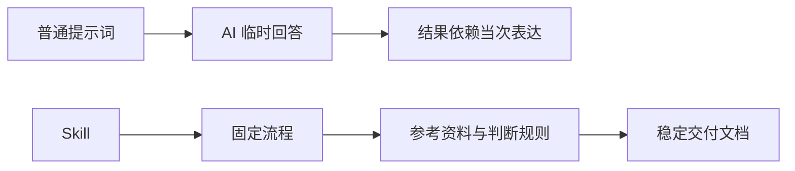
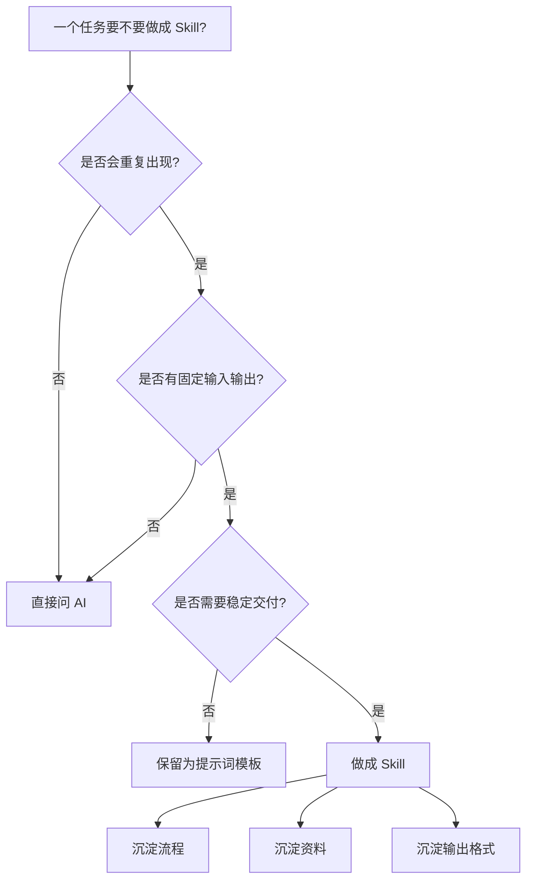
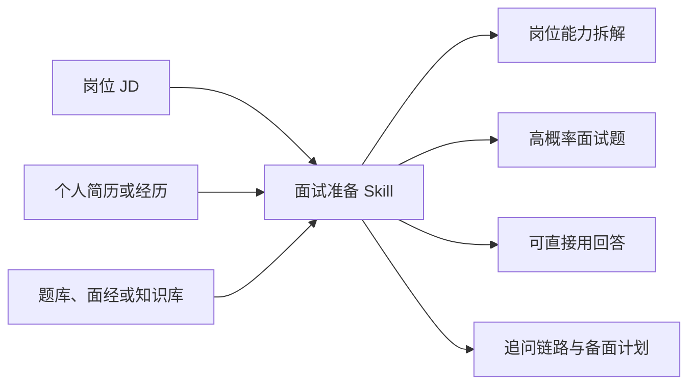
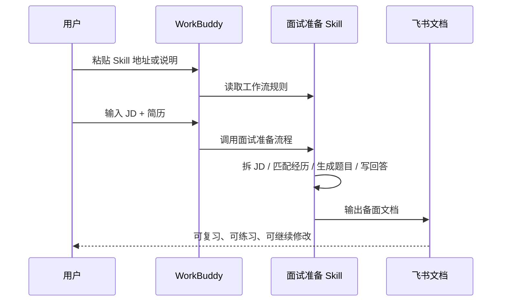

# Skill 使用教程

本文为 Markdown 版使用教程。想看飞书原版的完整流程图与演示，请查看：[从零开始使用 Skill（飞书版）](https://gte09oerz5.feishu.cn/docx/UlbidJbmVoGfI7xRgawcy1Mmnhb)。

这是一份给第一次接触 Agent Skill 的用户的上手指南。你不需要先会写代码，也不需要先理解文件路径；先选一个你真实要解决的问题，把对应的 Skill 链接和材料交给 Agent 就够了。

## 1. Skill 到底是什么

一句话说，Skill 不是一段更长的提示词，而是一套可复用的工作方法。

普通提示词只告诉 AI 这一次要回答什么；Skill 会进一步约定：需要哪些输入、如何拆解、应该参考什么资料、最后交付成什么格式，以及怎样检查结果。它适合反复出现、步骤相似、又希望每次都得到稳定交付的事情。

| 对比项 | 普通提示词 | Skill |
| --- | --- | --- |
| 使用方式 | 每次手动复制一段指令 | 安装后由 Agent 按任务调用 |
| 稳定性 | 依赖当次描述是否完整 | 流程、格式和资料可固定 |
| 适合任务 | 临时问答、简单改写 | 面试准备、简历定制、内容生产、项目复盘 |
| 结果 | 容易停在泛泛建议 | 更适合交付文档、表格、清单和脚本 |



例如，“帮我准备面试”只是一个需求；`interview-prep-brief` 会把它拆成读 JD、匹配经历、参考题库、生成高概率题、写出可直接练习的回答和追问链路。

## 2. 什么问题适合用 Skill

不是所有问题都值得做成 Skill。一次性、模糊、纯聊天的问题，直接问 AI 更快；反复出现、输入和输出相对稳定的任务，才值得交给 Skill。

| 任务类型 | 是否适合 | 原因 | 例子 |
| --- | --- | --- | --- |
| 一次性闲聊 | 不太适合 | 没有固定输入输出 | “你怎么看今天这条新闻？” |
| 重复判断 | 适合 | 判断标准可以沉淀 | 选题审核、简历匹配、投资初筛 |
| 文档交付 | 很适合 | 格式和质量标准可以固定 | 面试备书、竞品分析、项目复盘 |
| 多步骤工作流 | 很适合 | Agent 可以接力完成 | JD 分析 → 简历定制 → 面试准备 |
| 需要知识库 | 很适合 | 可复用题库、模板、案例库 | 面经、项目资料、个人笔记 |



## 3. 在哪些工具里使用

不同工具对 Skill 的支持方式不同。核心不是必须使用某一个产品，而是让你的 Agent 能读取 Skill 文件或链接，并按里面的流程做事。

| 工具 | 适合谁 | Skill 支持方式 | 建议 |
| --- | --- | --- | --- |
| WorkBuddy | 希望少折腾、直接让 Agent 做办公任务的人 | 支持自定义 Skills 与多 Agent 任务交付 | 国内用户可以优先尝试 |
| CodeBuddy Code | 开发者和技术用户 | 原生 Skills System | 适合代码和工程工作流 |
| Claude Code | 熟悉命令行和海外工具的用户 | 可通过 Skill 文件夹沉淀工作流 | 需要自行处理账号与网络环境 |
| Codex | 需要复杂自动化、代码或系统任务的用户 | Skills 可打包指令、资源和脚本 | 适合有 OpenAI/Codex 使用条件的用户 |
| Cursor / 其他 Agent | 已有固定工具习惯的人 | 可用 Rules、项目说明或提示词模拟部分能力 | 具体能力取决于产品 |

对大多数第一次使用的国内用户，重点不是比较工具强弱，而是先用一个能顺畅打开的 Agent 跑通一个真实任务。

## 4. 示例：用 WorkBuddy 跑面试准备 Skill

下面用一个常见场景演示：你拿到岗位 JD，希望快速得到一份能复习、能直接开口练习的面试备书。

你将使用：[interview-prep-brief](../interview-prep-brief/)



### 先准备这些材料

| 材料 | 是否必须 | 怎么给 Agent | 缺失时怎么办 |
| --- | --- | --- | --- |
| 目标岗位 JD | 必须 | 复制岗位职责和职位要求 | 至少提供岗位名称和行业 |
| 个人简历 | 建议提供 | 粘贴简历文本或 2-3 段核心经历 | 可以先生成基础版，但回答会更泛 |
| 目标公司/业务 | 建议提供 | 例如“某手机厂商 AI 产品经理” | 只给岗位也能运行 |
| 题库/面经 | 可选 | 粘贴文档内容或可访问链接 | Skill 会按 JD 和岗位逻辑补齐 |
| 输出位置 | 可选 | 飞书文档或本地文件 | 无飞书权限时生成本地 Markdown |

### WorkBuddy 操作流程

| 步骤 | 你要做什么 | WorkBuddy / Agent 会做什么 | 产出 |
| --- | --- | --- | --- |
| 1 | 打开 WorkBuddy，新建一个任务 | 进入 Agent 工作台 | 一个可执行任务窗口 |
| 2 | 粘贴面试准备 Skill 的地址或说明 | 读取 Skill 规则，理解输出结构 | Skill 被加载 |
| 3 | 粘贴目标岗位 JD | 拆解岗位职责、能力模型、面试重点 | 岗位能力地图 |
| 4 | 粘贴你的简历或经历 | 匹配经历和岗位要求，判断哪些内容可用于回答 | 候选人答题素材 |
| 5 | 告诉它“生成一份飞书备面文档” | 生成高频题、参考答案、追问链路和备面计划 | 飞书文档或本地文档 |
| 6 | 反复追问某一道题 | 模拟面试官深挖，并帮你优化答案 | 更接近真实面试的练习材料 |



直接复制下面这段给 Agent：

```text
请调用面试准备 Skill，帮我基于下面的岗位 JD 和候选人经历，生成一份面试备书文档。受众是正在准备互联网产品/运营/AI 相关岗位面试的求职者。请重点输出：岗位能力拆解、高概率面试题、可直接使用的回答、面试官连续追问、答案优化建议和 3 天备面计划。若能创建飞书文档，请直接生成飞书文档；如果不能，就输出一份结构清晰的本地 Markdown 文档。

Skill 地址：
https://github.com/Luyu2026/Skill-Bible/tree/main/interview-prep-brief

【目标岗位 JD】
粘贴岗位职责和职位要求

【候选人简历/经历】
粘贴你的简历，或写 2-3 段核心项目经历

【补充资料】
如果有题库、面经、飞书文档链接，也粘贴在这里

【输出要求】
1. 回答不要太空，要有数据和业务细节。
2. 每个答案尽量能直接在面试中使用。
3. 对关键问题给出面试官可能追问的 2-3 轮。
4. 如果信息不足，请标出需要我补充的材料。
```

## 5. 最小行动清单

- 选一个你最近要投递或面试的岗位，复制完整 JD。
- 准备一版你的简历文本，哪怕很粗糙也可以。
- 打开 WorkBuddy，新建任务，把上面的调用指令粘进去。
- 让 Agent 生成一份面试备书文档。
- 挑 3 道最可能被问的问题，继续让 Agent 模拟面试官追问。

第一次不用安装十个 Skill。先把一个真实场景跑通，你会更容易判断下一个该用什么。

## 资料来源

- [WorkBuddy 官方页](https://copilot.tencent.com/work/)
- [CodeBuddy Code Skills 文档](https://www.codebuddy.ai/docs/cli/skills)
- [OpenAI Codex Skills 文档](https://developers.openai.com/codex/skills)
